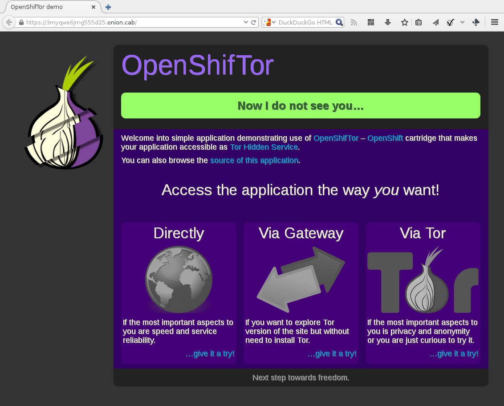

OpenShifTor
===========

Tor cartridge for OpenShift. Make your application accessible
via Tor! (You will get cool .onion address.)

Example
-------

To save you of long preambles, let us just dive into example where
we will create hidden service for `diy`-based application:

~~~~ .bash
appname=hidden
rhc app create "${appname}" --no-git \
    diy \
    'https://raw.githubusercontent.com/xkollar/tor-openshift/master/metadata/manifest.yml' \
    --from-code 'https://github.com/xkollar/openshiftor-example.git'
~~~~

And that is all... you just have to wait till Tor builds and starts for
the first time (this is done asynchronously and it takes some time so
be patient).

Take note of the `.onion` hostname that was generated for your service.
If you forgot that (or you want to supply your own key), appropriate
places to look are `"${OPENSHIFT_TOR_DIR}tor/hidden_service/hostname"`
and `"${OPENSHIFT_TOR_DIR}tor/hidden_service/private_key"`.

If you want to check whether you was successful but you do not want
to install Tor yourselves, you can use some Tor gateway, e.g.
[tor2web.org](https://www.tor2web.org/).

Integration notes
-----------------

When using with your own cartridge make sure that your application
use variables in form `*_PORT` and `*_IP` or `*_ADDRESS` so this
cartridge will know where to forward requests. For example `diy`
cartridge uses `OPENSHIFT_DIY_IP` and `OPENSHIFT_DIY_PORT`.

To prevent Tor from restarting (that causes .hidden site inavailability
for some time) use `keep_tor_running` marker.

~~~~ .bash
touch .openshift/markers/keep_tor_running
git add .openshift/markers/keep_tor_running
git commit -m 'Keep Tor running'
git push
~~~~

Note
----

There is more to Hidden services. Before doing anything,
you should probably educate yourself a little. Good starting points:

* https://www.torproject.org/docs/hidden-services.html.en
* https://www.torproject.org/docs/tor-hidden-service.html.en
* https://blog.torproject.org/blog/hidden-services-need-some-love

Also, when you want to run this gear at servers that are
not yours, be sure to read their terms and conditions, e.g.
[https://www.openshift.com/legal](https://www.openshift.com/legal).
This cartridge is inteded to provide possibility to access your applicateion
via `.onion` hosname, not to hide anything bad.
